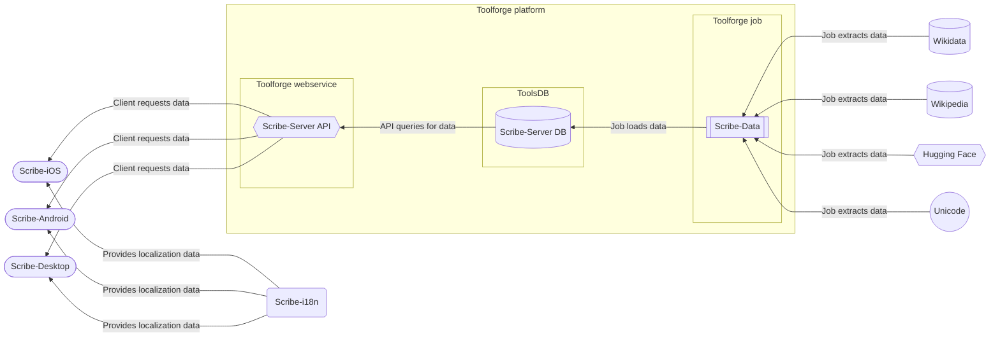
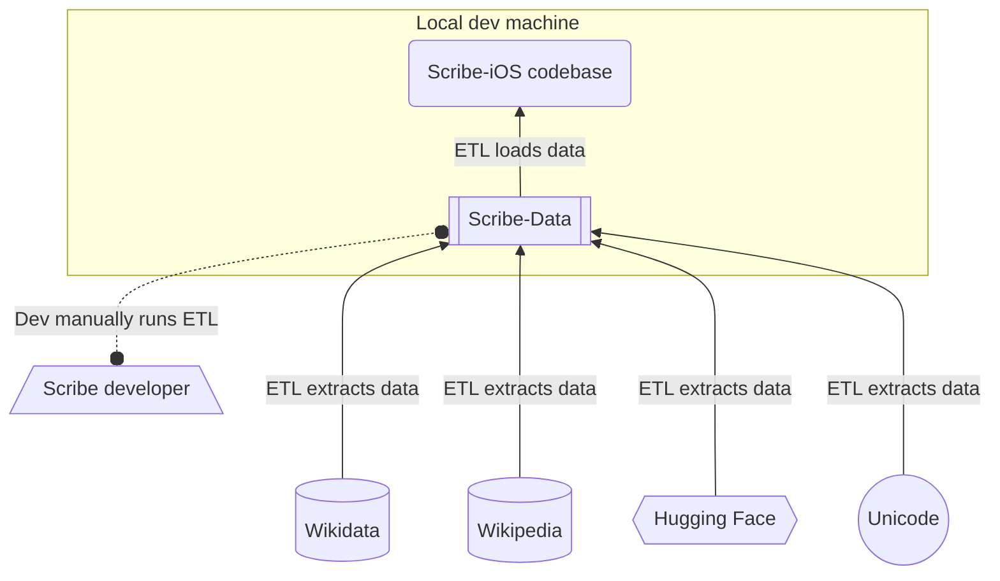

# [Architecture](https://github.com/scribe-org/Organization/blob/main/ARCHITECTURE.md)

This markdown file documents the architecture for the whole of [Scribe](https://github.com/scribe-org) - including the applications, the services, the processes, and the external systems and sources with which it interacts. As the file is meant to be a living document, edits are welcome to expand and update it!

## Contents

- [Full architecture diagram](#full-architecture)
- [Current architecture diagram](#current-architecture)

## Full architecture diagram [`⇧`](#contents)

The following diagram represents the relationships between the Scribe projects and external systems and sources, as they relate to the development plans for Scribe. In other words, the shown architecture depicts a future state for Scribe, which is subject to revision if plans for Scribe change.

## Current architecture diagram [`⇧`](#contents)

The following diagram represents the relationships between the Scribe projects and external systems and sources, as they relate to the current state for Scribe. In other words, the diagram is meant to receive more frequent edits, as the intent for it is to accompany the evolution of the Scribe architecture.

The architecture diagrams above were created using [mermaid](https://github.com/mermaid-js/mermaid), the diagramming tool with rendering supported in GitHub markdown.
